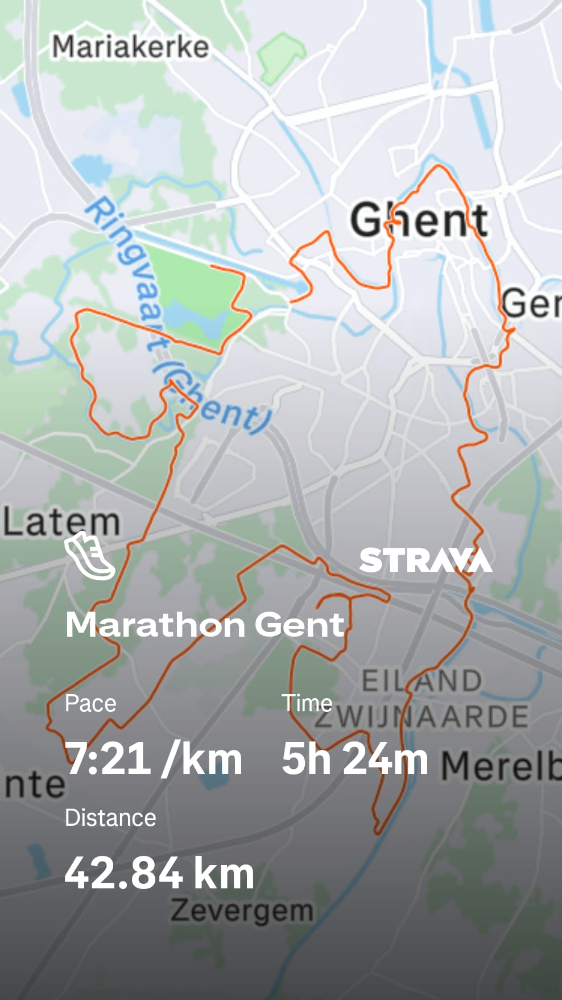

## Some history

At the time of deciding I would run a marathon, I had already a couple of years of experience with running longer distances.
It was in the summer of 2022 that I decided to run a marathon, at which point I had been running consistently for about 6 years.
During those 6 years, I had ran races like the Antwerp 10 miles, the 20km of Brussels, some half marathons and so on.
But I had never ran more than 22km in a single run.

It scared me to start training, I had been putting it off for years.
Running a total of 42.195km in a single run seemed like an impossible task.
I remembered how running a half marathon had been a huge challenge, and I couldn't imagine how I would be able to run twice that distance.
But I was determined to do it, so I started training.
Now was the time in my life that I simply had to do it: I had the time, the motivation and the physical condition to do it, so I had to take the plunge.

## The training

Building up to the marathon was a long and difficult process, sadly with its struggles.
During the training block for a marathon, you have to run a lot of kilometers, and you have to do it consistently.
I bumped up my weekly mileage from around 30km to around 80km with even some outliers to 90km, which was a huge increase.
Looking back to it, this increase in weekly mileage was definitely too much.

I had times that I ran 19km in the early Wednesday morning before work which was just too much.
Especially since I also had a 29km run in the legs from the previous Sunday and had a 32km long run lined up on the next Sunday.
I would never do these kinds of distances, it was just way too much time on my feet.

I just wasn't listening to my body enough.
Pushing through pain, not doing any strength work, not eating well enough, ... 
I had post-run notes of "Quadriceps had a nagging feeling" and I just kept on running.
It was just a recipe for disaster.
I was still hopeful that I would run a decent marathon, but I was delusional.
A 4h marathon seemed achievable, which was in hindsight idiotic to even consider running so fast.

I had long training runs on Sundays where I wound up considering calling my girlfriend to come pick me up and just quitting running.
The good thing about it all? 
I discovered so many streets in and around Ghent!
Such distances really gave me the opportunity to go sightseeing, to look for hidden gems, to go through parts of the city that I would never go through otherwise.

## Marathon day

On the day of the marathon, I was hella nervous.
Let me give some highlights of what happened during the marathon.

### The wettest run I had ever done

I knew it was going to be a rough day, especially since it was raining.
What ended up happening, was that I would run the whole distance in the pouring rain.
The bike ride to and from the marathon starting area was in the pouring rain as well.
Taking into account the time it took to bike, the time to get to the starting line, to wait for the start, the running itself and then the painful ride back, I had somewhere around 7h of being outside the rain.
I was drenched.

Add to that, that while passing one of the drink stations, someone decided to try to throw away their cup in the distance into one of the bins.
They definitely miscalculated the trajectory of their cup, throwing it against me.
Didn't really matter as I was already soaked with rain, the stickiness of a sports drink didn't even matter.

### I underfueled

The days before the marathon, I did what you always have to do: eat lots of carbs to ensure you are properly carb loaded.
But on the day itself, I hadn't trained my gut enough.
I had troubles digesting the energy bars that I was using (what on earth was I thinking of not running with gels...).
Trying to eat a quarter of a banana was a bad idea.
I had a sports drink with me but didn't drink it quickly enough.

### Hitting the wall

Not literally ofcourse, but what usually happens during a marathon is that you eventually end up what they call "hitting the wall".
It's a certain point that you just feel like you can't go any further.
Your legs are dead, your energy is totally depleted, your mental is broken, quitting seems like the only way to survive.
For most people that's somewhere around the 30km mark, hence why doing a 32km training run is almost always included in a marathon training block, to test out your threshold.
It was near a drinking station where they also had a toilet, which I happily used but while peeing I was seriously considering of just stopping right there.

### Running mostly alone in the last 5km

I was slow and the weather was horrendeous.
As such, the amount of people supporting runners during the marathon started to decline rapidly as I progressed more in terms of distance.
The last 5km was around the neighbourhood of Afsnee, going back the Blaarmeersen where the start and finish line was.
If you don't know the area, this is mostly fields and some small streets with houses. 
Basically a typically quite neighbourhood.
Running mostly alone there was hell for me: I couldn't keep motivating myself.
I love following someone as it also gives me a goal of keeping up and maybe even passing them.
But after already 5 hours of running in the pouring rain, I just couldn't keep motivating myself.

### The first-aid guy who checked up on me

During the final kilometers of the marathon, a first-aid guy was biking back and forth to check up on the last runners.
The first time he passed, I managed to give a friendly hello, as a way of letting him know I would be fine.
The second time, it was more difficult to convey that I was okay.
And the third time he passed, he kept biking alongside me for what felt like 10 minutes as he clearly wasn't convinced that I was okay.
Not feeling okay sucks, but having a first-aid professional not being convinced that you'll be okay is kind of frightening.

### They had cleaned up the last drinking station

I was longing for some electrolytes at 39km.
I looked so forward to some cold drinking fluids only to be disheartened by the fact that they had already packed up.
This reawlly hit hard as it was clear that I was painfully slow...

### I cried almost all of the last 5kms

The combination of the last drinking station being cleaned up, having a first-aid guy checking up on you, hitting the wall and the running alone completely demotivated, just made me break even more.
I think I cried for almsot all of the last 5kms, as the culmination of all those demotivating experiences just hit home so hard.

### Sprinting for the last 200 meters

How on earth I was able to do that, I have no idea.
The finish was in the sports stadium of the Blaarmeersen.
I thought that when you entered, that you would immediately cross the finish line.
Nope, you still had to do about 300 meters around the running track.
At 200 meters to go, someone started passing me.
I instantly thought "Bitch no! You shall not pass!" and just sprinted everything I had.
I almost collapsed on the finish line because of this as I was really looking for the last bit of energy in my legs that I had no idea was still there.

### I almost went home without a medal

I was so tired, so deflated, crying so much that I just walked by the ones handing out medals.
Thank god they ran to me or I wouldn't have had that precious lump of metal.

## Post marathon

All the clichés are true.
You are almost unable to take stairs.
You sleep terribly that first night.
I was horribly dehydrated.
My stomach was so upset.
"Never again!" was the definite thought in my head.

A year and a half later, I ran my second and at the moment of writing, last marathon.
Less training volume, better fueling strategy and just a healthier way of trainig made me run my second marathon in 4 hours, 44 minutes and 29 seconds.
My first one I ran in 5 hours, 23 minutes and 59 seconds.
Thus I improved by a whopping 39 minutes and 30 seconds.

Will I ever run a marathon again? 
I don't know, maybe not.
Having a 1 year old running around at home and just generally not being interested in running so much distance, I might not end up doing a marathon ever again.
I'm currently focusing more on 10kms as it helps having a healthy balance between work, exercising and raising a child.
But who knows, maybe I'll someday want to go through this hell again.

