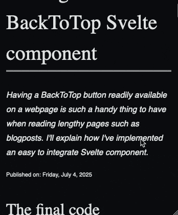

## The final code

Let me first give the code and then we'll dive into a bit more detail to explain each part of it.

```svelte
<script>
  const scrollTopThreshold = 500;
  let hidden = true;

  function scrollToTop() {
    document.documentElement.scrollIntoView({ behavior: "smooth" });
  }

  function handleOnScroll() {
    hidden = document.documentElement.scrollTop < scrollTopThreshold;
  }
</script>

<svelte:window onscroll={handleOnScroll} />

<button
  class={["back-to-top", { hidden }]}
  on:click={scrollToTop}
  aria-label="Scroll back to top of page"
></button>

<style>
  .back-to-top {
    position: fixed;
    right: 1rem;
    bottom: 1rem;
    opacity: 1;
    transition:
      opacity 0.4s,
      visibility 0.4s,
      transform 0.4s;
    user-select: none;
    background-color: transparent;
    cursor: pointer;
    border: 0;
  }

  .back-to-top::after {
    content: "";
    display: block;
    background-image: url("/icons/arrow_circle_up.svg");
    background-size: cover;
    height: 3rem;
    width: 3rem;
  }

  .back-to-top:hover {
    transform: translateY(-0.5rem);
  }

  .back-to-top.hidden {
    opacity: 0;
    visibility: hidden;
  }
</style>
```

## Breaking down how every part works

### The handler to scroll back to the top: scrollToTop()

```js
function scrollToTop() {
  document.documentElement.scrollIntoView({ behavior: "smooth" });
}
```

Thanks to the [scrollIntoView function](https://developer.mozilla.org/en-US/docs/Web/API/Element/scrollIntoView), we can force the browser to scroll an element into view.
In our case, that's the main documentElement (i.e.: our `html` tag).
Thanks to `{ behavior: "smooth" }` and no definition of the `inline` and `block` parameters, we define that the browser should perform a smooth scrolling motion to the top of our window.

In our Svelte code, we call this `scrollToTop()` as an `on:click` event on the button that we show in the bottom right corner of our screen:

```svelte
<button
  class={["back-to-top", { hidden }]}
  on:click={scrollToTop}
  aria-label="Scroll back to top of page"
></button>
```

### Keeping track of the scrolling position: handleOnScroll()

```js
function handleOnScroll() {
  hidden = document.documentElement.scrollTop < scrollTopThreshold;
}
```

We bind `handleOnScroll()` to the `onscroll` event on the `window` object with `<svelte:window onscroll={handleOnScroll} />`.
What this effectively does, is each time the user scrolls on our page, it calls `handleOnScroll()`.
This checks if we have a `scrollContainer` and checks whether we have scrolled past our predefined threshold.
The threshold is a way to determine whether we should hide the scroll back to top button.
If the threshold is a very low number, the back to top button will be shown almost instantly as it corresponds with the amount of pixels that the user should have scrolled before the button is shown.

### The scroll back to top button in HTML

```svelte
<button
  class={["back-to-top", { hidden }]}
  on:click={scrollToTop}
  aria-label="Scroll back to top of page"
></button>
```

This is just your average button that we hide if `hidden` is `true`.
We do this by setting the `class` attribute to `["back-to-top", { hidden }]`.
What this means, is that we always add `back-to-top` class and conditionally the `hidden` class since that will only be there if `hidden` is truthy.

### The styling and animation

```css
.back-to-top {
  position: fixed;
  right: 1rem;
  bottom: 1rem;
  opacity: 1;
  transition:
    opacity 0.4s,
    visibility 0.4s,
    transform 0.4s;
  user-select: none;
  background-color: transparent;
  cursor: pointer;
  border: 0;
}

.back-to-top::after {
  content: "";
  display: block;
  background-image: url("/icons/arrow_circle_up.svg");
  background-size: cover;
  height: 3rem;
  width: 3rem;
}

.back-to-top:hover {
  transform: translateY(-0.5rem);
}

.back-to-top.hidden {
  opacity: 0;
  visibility: hidden;
}
```

Essentially, we only have 2 classes: `back-to-top` and `hidden`.
`hidden` is just there to hide the back to top button while `back-to-top` is all the styling of the button.
We use a SVG image as a background and have added some small animation to make the button appear/disappear slowly as well as moving up a little bit when hovering.

## Conclusion

That’s all it takes to implement a clean, functional BackToTop button in Svelte.
A small component that's added to your website can make a real difference in usability, especially for those longer webpages.
Svelte was the perfect lightweight library for this little component but this can easily be translated to another library or even written in plain JavaScript.


