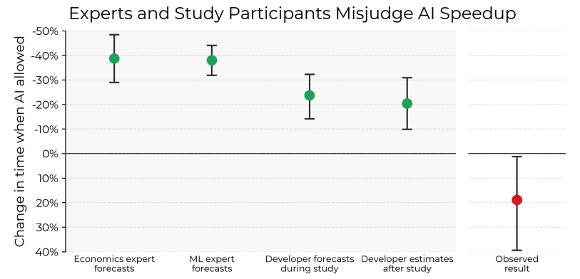
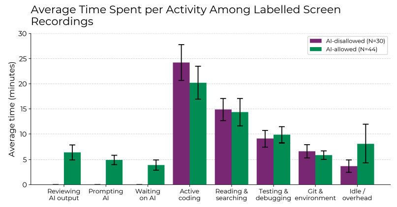

## What is the study and who conducted it

[The study](https://metr.org/blog/2025-07-10-early-2025-ai-experienced-os-dev-study/) is performed by METR.
METR is an acronym for Model Evaluation & Threat Research.
They are a team of researchers and engineers conducting rigorous, empirical research to ensure the safe development of advanced AI systems.
Crucially, METR has [not accepted funding from AI companies](https://metr.org/about#funding).

## What they actually measured

They conducted a randomized controlled trial where 16 developers with experience in using AI completed 246 tasks (averaging 2 hours) on popular open-source repositories.
The tasks were actual bugs and features to be programmed.
Tasks were randomly assigned to either AI-assisted (using tools like Cursor Pro with Claude 3.5/3.7 Sonnet) or control (no AI) conditions.
The tasks were tracked via screen capture.

Before starting a task, they had to estimate how much time they thought was going to be spend on that task both with and without AI assistance.
Not only did the developers give estimations, there were also estimations given by economics experts and machine learning experts.

## The results

This graph is quite surprising.
All groups estimated that there was going to be time saved to complete a task.
Even after using AI, developers estimated that they saved time during the performing of the tasks.

The observed results show quite the opposite, that there was actually more time lost.
In the study, they have broken down the actual time spent on all parts of the tasks, which shows a possible explanation of why developers were slower with AI:

In the situation that they were allowed to use AI, it makes sense that they spend time on reviewing AI output, prompting the AI and waiting on the results of the AI.
They basically constantly had to describe what they needed from the AI.

## My 2 cents

At first I was surprised by the amount of active coding that still needs to be done by the developer.
In an ideal world, the AI would reduce the amount of active coding needed.
Anecdotally, AI saves me time on boilerplate (e.g., unit tests) but increases total task time due to having to refactor the AI code.

With the current state of AI, it feels more like having a colleague that I can subvert my low effort tasks to.
It can also help to quickly setup some basic stuff with commands like `write me a React component that does this basic thing` or `write me vitest unit tests for this function`.
After which I just have to tweak it and fit it properly in the rest of the code.

As soon as AI feels more like an actual colleague that I can pairprogram with (or even better, mobprogram!), I'll happily integrate it more in my daily workflow.
Best case is that an AI can feel like an actual colleague that can take on tickets, do the analysis, write code and put it ready in a pull request.
For AI to truly accelerate development, it needs deeper context awareness (e.g., understanding codebase style, architecture) and proactive problem-solving.
This way it elevates to the level of a proper developer, not just a code autocomplete tool like it now is.
But looks like we're a long way from that.
